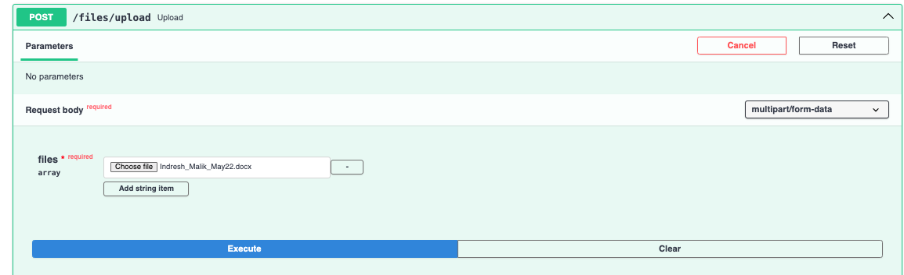
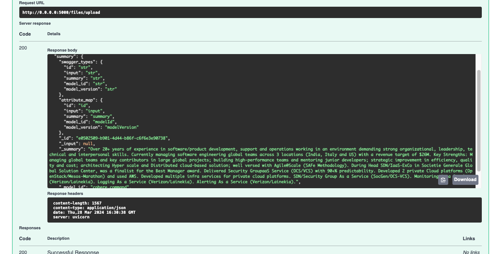

### A sample FAST API program to convert uploaded files to text 

#### Launch the App

```bash
$pip install -r requirements.txt
$export compartment_ocid="OCID"
$export username = "XXXX"
$export password = "ZZZ"  
$python main.py
```
- Launch the application as http://localhost:5000/docs
- Provide credentials using authorization.
- Use `post` API to upload and get the summary

- Execution snippets 



